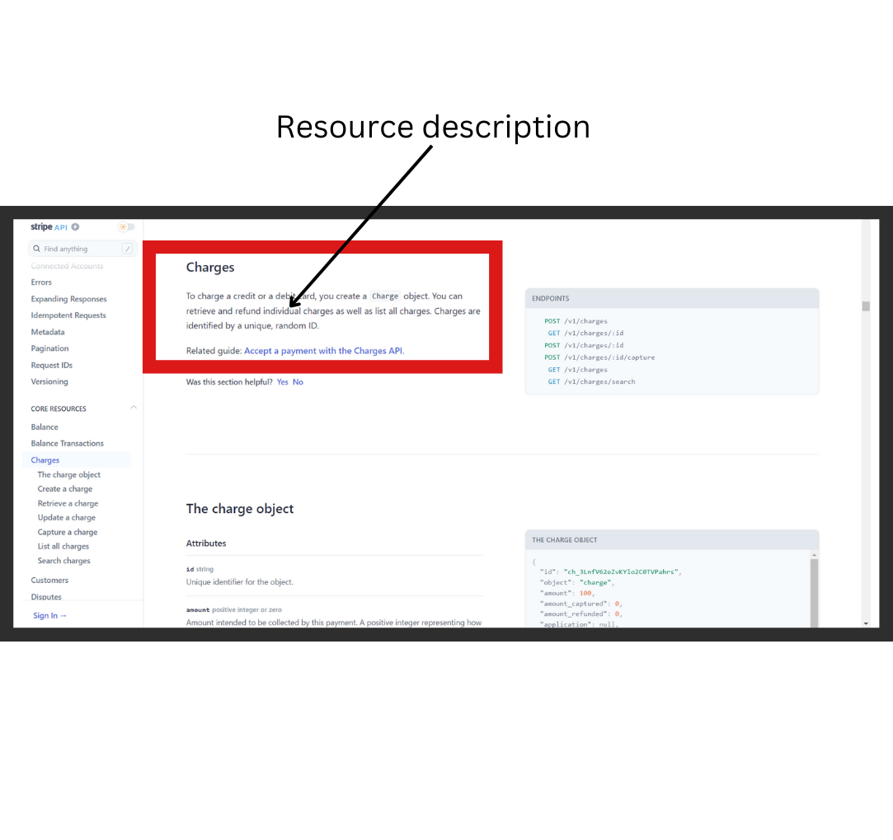
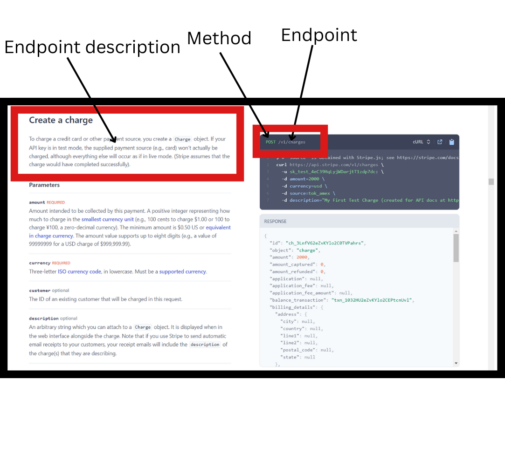
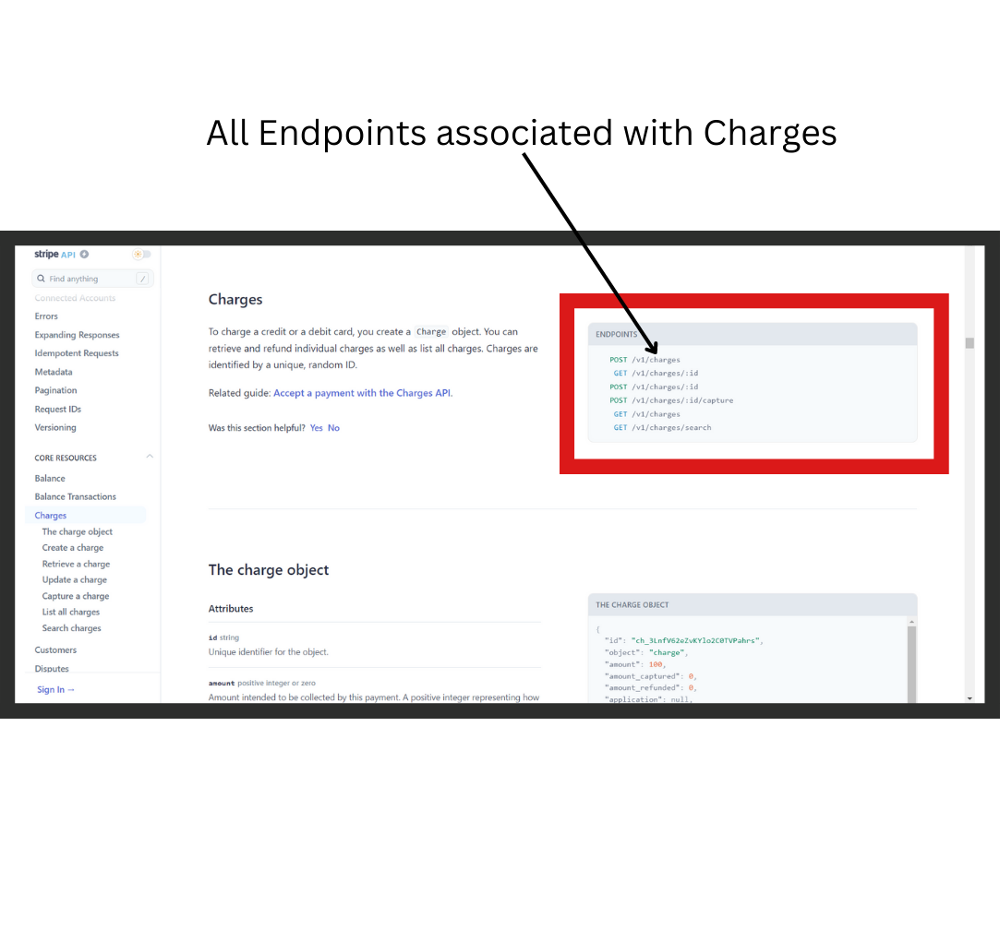
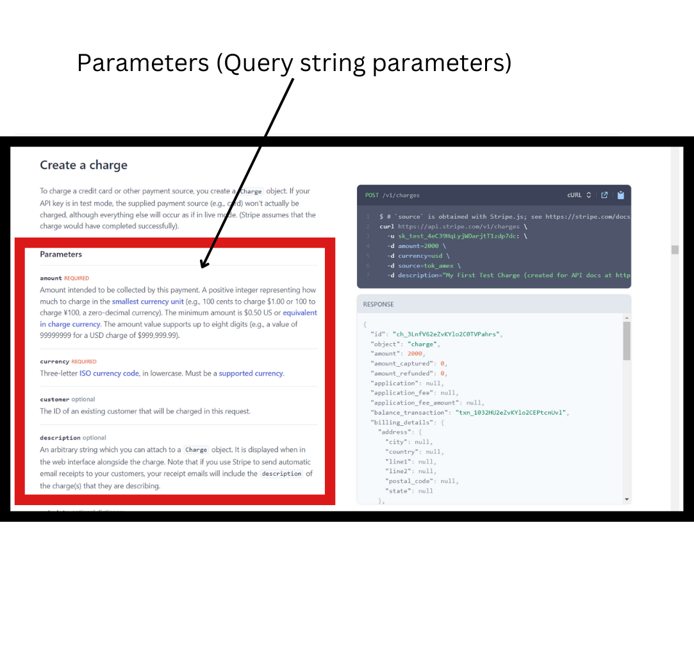
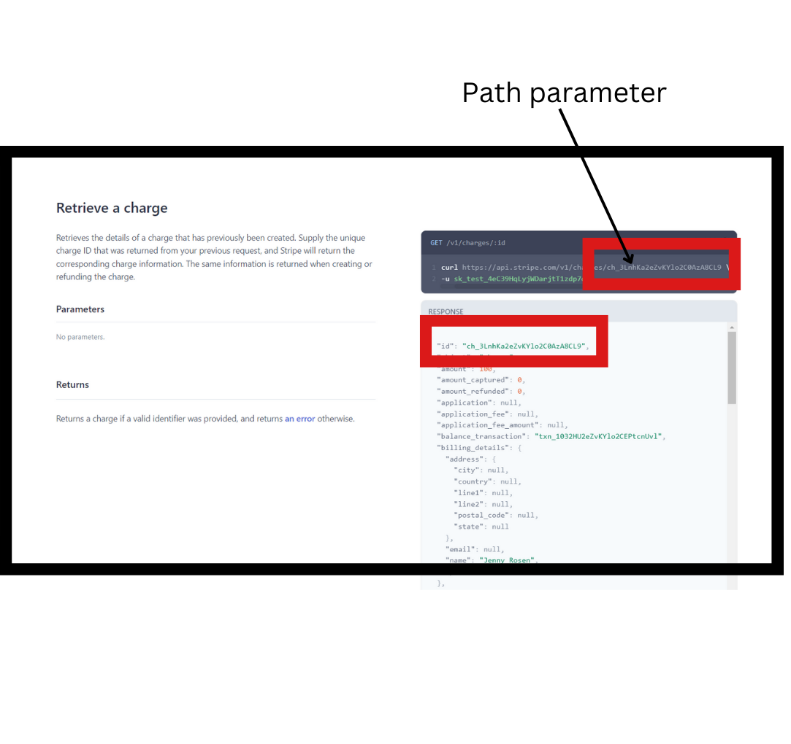
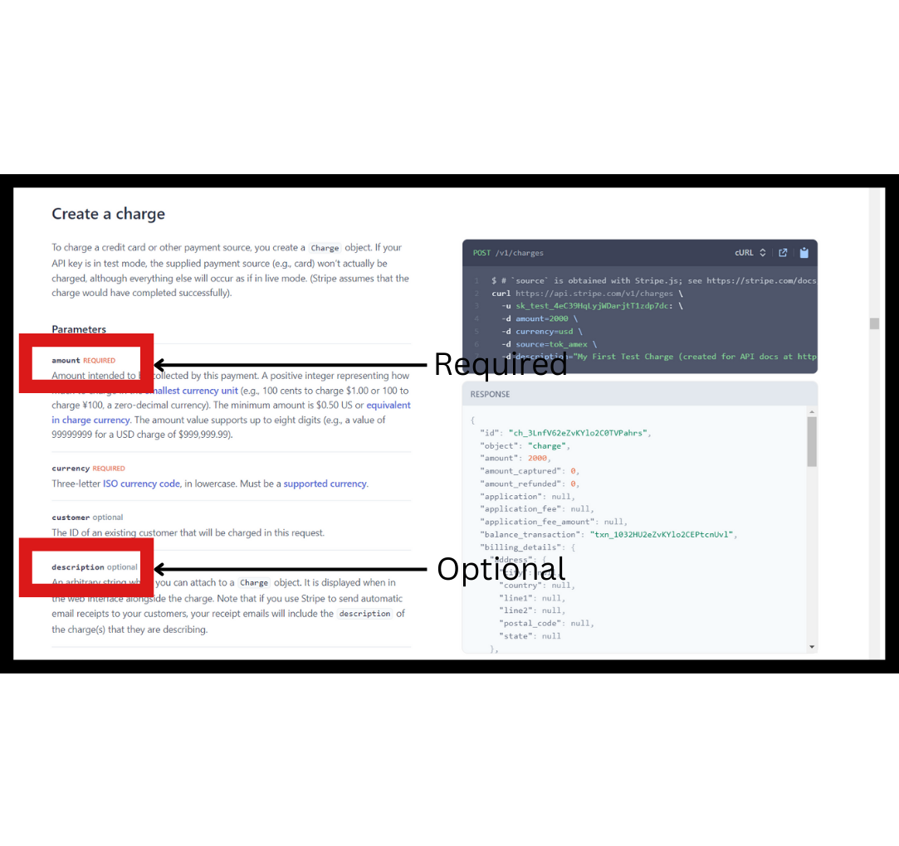
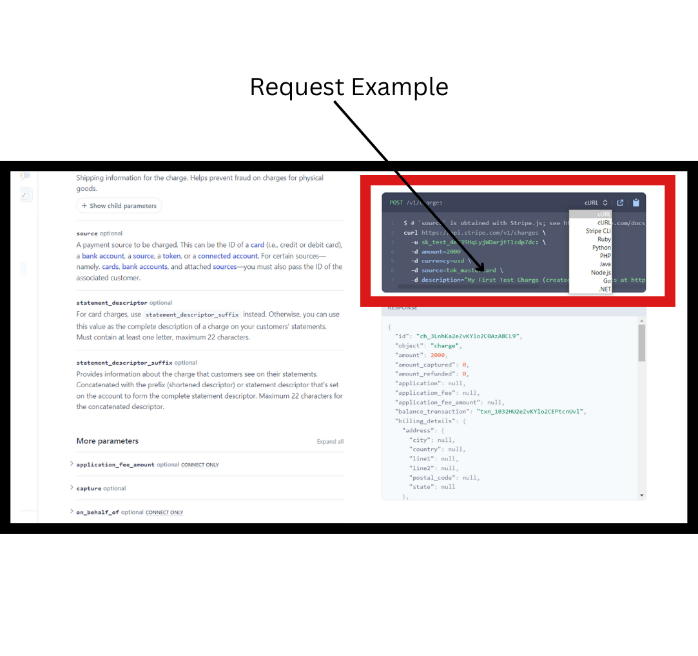
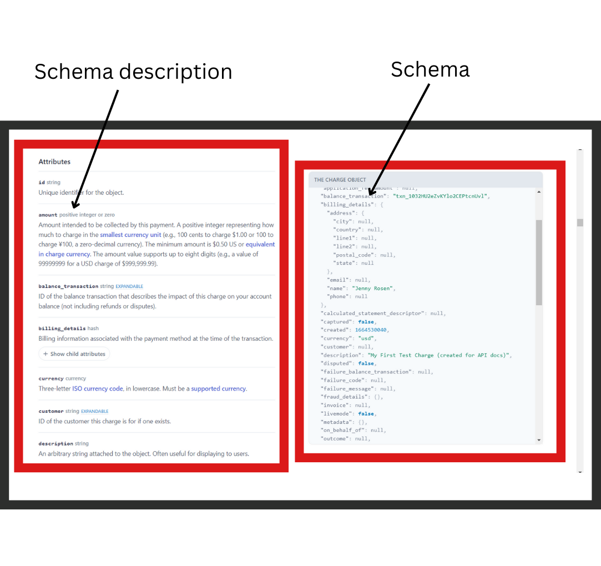

# How to Write Good API reference guides 

Technical documentation is a broad field with a lot of sub-disciplines. In previous articles published, we have covered steps on creating good [tutorials](https://blog.contentre.io/how-to-write-good-technical-tutorials/) and [how-to guides](https://blog.contentre.io/how-to-write-a-good-how-to-guide/). In this article, we want to talk about the most used guide by developers: reference guides. 

Reference guides are barebone and straightforward. They provide developers with just what they want: the APIs or the software components. 

You can think of reference guides as trying to give a talk without beating around the bush, and just going straight to the point, delivering the talk and saying nothing more.

It is for this reason, in fact, reference guides are most popular for API documentation.

They allow technical writers to easily curate a list of software components making up a software machinery, while helping developers (users of reference guides) a quick access to everything about a software technology.

Good reference guides provide an easy way for developers to easily browse through a list of APIs, alongside short text descriptions to enable them to know the purpose of the APIs. 

For instance, Stripe’s three-columns one-page reference guide has now become an API reference guide standard used all over the world by various software companies.

It provides a simple interface, allowing developers to easily browse through a reference guide without having to open a new page; the three-columns making it easy for developers to get all the information they need about an API, including the CRUD methods of the API and some code samples demonstrating the API.  

## What is a Reference guide?

Daniele Procida defines reference guides as technical descriptions of a machinery and how to operate it. They are information-oriented in nature. This is in contrast to tutorials that are learning-oriented or how-to guides that are problem-oriented.

Creating tutorials and how-to guides are much more straightforward, easier to guess, and intuitive. We have all come across tutorials and how-to guides at several points in our lives even though not in the more standardised form as we have in technical writing. 

Think of moments as a child when you were getting instructions from your parents on how to do a home chore, or a friend teaching you the newest game in town. These are forms of tutorials and how-to guides.

Reference guides, on the other hand, can be trickier to create. It would appear it is the only documentation content that sets apart software technical documentation from every other forms/types of writing.

Unlike tutorials and how-to guides, creating reference guides follows **laid out conventions and styles instituted in the software industry.**

Due to this, the excellence of the technical writer in creating reference guides relies more on mastering these conventions than their writing prowess and creativity.

Moving on, we would look at the two main types of APIs reference guides are used to document.

## Types of APIs

There are two broad classifications of APIs: Web APIs and Native Library APIs.

### Web APIs

When developers speak of API, web APIs are almost always the one being referred to. 

Web APIs, or more fully known as web service APIs, are APIs that send and receive messages (payloads) using HTTP protocols to send requests(CRUD/HTTP methods) and to receive responses. XML and JSON are the standard formats for sending and receiving messages via web APIs today.

Web APIs are language agnostic, meaning they are compatible with code implemented in various programming languages. 

Web APIs have grown considerably over the years given their diverse utility to developers. Their growth in the digital space has reached a height where they have become stable enough for new business models to be engineered around them.

Web APIs have also evolved over the years. One of the earliest being the SOAP (Simple Object Access Protocol) APIs: web services that rely on a strict XML protocol to define the message exchange format for requests and responses. 

This strict enforcement on the message format that characterises SOAP APIs have coalesced in the development of the less stricter but equally standardised paradigm for sending and receiving messages over the web: REST APIs.

Representational State transfer (REST) APIs transfer messages using URLs, endpoints serving as the means to access resources delivered in XML or JSON format. REST APIs have become the new standard for sending requests and receiving responses over the web.

Since the development of REST APIs, other web service APIs have been developed. These include GraphQL APIs developed by Facebook, RPC-based APIs, gRPC APIs, Voice assistant APIs, Internet of things APIs, and so on.

### Native Library APIs

When developers use classes and functions from a programming language or framework, say React, they would usually just refer to them as classes or functions or methods, but the often unspoken way of referring to them is that they are also another form of API, better known as Native Library APIs.

Just like Web APIs, they provide developers with a simple interface (the classes and methods) that allows access to functionalities they do not know anything about how they are implemented.

Unlike web APIs, however, they are implemented locally in a code project, where they are used to expand the operations that can be performed within the software project. Native library APIs do not need the web to be accessed and utilised.

Now, let's talk about the five common sections involved in documenting APIs—web APIs specifically. Knowing these sections would be most useful in documenting any web API. We won't be covering documentation for Native Library APIs in this article.

## 5 Common Sections in Documenting Web APIs
 
For illustrative purposes, we would be using sections from the Stripe API documentation in going through this section of the article. So let's get started.

### Resource description

A resource is information returned by an API. Consequently, a resource description is a short text description that informs the developer on the information returned by an API. The information returned is called the response.

<figure markdown align="center">

  <figcaption><i>Resource description</i></figcaption>
</figure>

For instance, the Charge resource allows the developer to create, retrieve, refund and retrieve all (as a list) `Charge` objects.

Following best practices, a good resource description should be between 1-3 sentences. Imperative sentences that start with a verb are best for writing resource descriptions.

### Endpoints and Methods

REST APIs allow you to access resources using URLs. Endpoints represent the means through which you access a resource. 

<figure markdown align="center">

  <figcaption><i>Endpoint and Method</i></figcaption>
</figure>

The URL to access a resource is usually made up of a base path and an endpoint. For instance, to create a charge (which creates a new ``Charge`` object), we would use this URL:`https://api.stripe.com/v1/charges`.

`https://api.stripe.com` is the base path; `v1/charges` is the endpoint that allows you access to create a new ``Charge`` object.

Methods, on the other hand, indicate the allowed interactions with a resource. Common methods include GET, POST, PUT, and DELETE. Basically, CRUD methods.

Following best practices, you must state a method and an endpoint together as in the image above, alongside a description of the endpoint informing the developer of the information the endpoint returns.

For a better organised API documentation, you can also go ahead and list the endpoints and methods associated with a resource as Stripe did here.

<figure markdown align="center">

  <figcaption><i>All endpoints associated with Charge</i></figcaption>
</figure>

### Parameters

Parameters are options you can pass to the endpoints to configure, constrain or influence the response you get for a request. Parameters are included in the request body.

<figure markdown align="center">

  <figcaption><i>Parameters</i></figcaption>
</figure>

There are several types of parameters: header parameters, path parameters, and query string parameters.

Header parameters are parameters included in the request header, which are usually related to authorization. Think passwords and API keys.

Stripe uses API keys for authorization/authentication. This is indicated by the ``-u`` prefix in the cURL code in the request example in the picture above. API keys are passed as header parameters in the request header.

Path parameters are part of the endpoints themselves. They are not optional.  You can think of them as variables. For instance in the "Retrieve a charge" endpoint, the ``id`` is passed as a path parameter to GET a charge object of that Id.

```
https://api.stripe.com/v1/charges/{id}/, 
where id = “ch_3LnhKa2eZvKYlo2C0AzA8CL9”
```
<figure markdown align="center">

  <figcaption><i>Path parameter</i></figcaption>
</figure>


`https://api.stripe.com/v1/charges?amount=2000&currency=usd &source=tok_amex`

Query string parameters are parameters that appear after the question mark (?) in the endpoint. The parameters and their values following the question mark is called the query string. It should be noted that the ordering of the parameters is insignificant.

Depending on the API endpoints, certain query string parameters might be required, and others optional as in the image from the Stripe documentation on creating a charge.

<figure markdown align="center">

  <figcaption><i>Required and Optional Parameters</i></figcaption>
</figure>

### Request example 

A request example is a sample request using an endpoint, showing some parameters configured.

<figure markdown align="center">

  <figcaption><i>Request Example</i></figcaption>
</figure>

Most API documentation always includes several request examples in different programming languages to make it easier for developers to implement the API in their code. This makes for good user experience.

### Response example and Schema

Response example is the response to a request example. The response example is not comprehensive of all parameter configuration or operations associated with an endpoint.

<figure markdown align="center">

  <figcaption><i>Response example</i></figcaption>
</figure>

The schema on the other hand, is comprehensive of all parameter configuration or operations. 

For good organisation, the Stripe API documentation defined the schema alongside the Charge resource description at the start, while the response samples are provided for each endpoint associated with the Charge resource.

<figure markdown align="center">

  <figcaption><i>Schema</i></figcaption>
</figure>

## Summary

So that's it for this article. This article is just a brush on the surface on creating API reference documentation. For a more in-depth understanding on documenting API endpoints, you can check [API documentation course](https://idratherbewriting.com/learnapidoc/) by Tom Johnson.